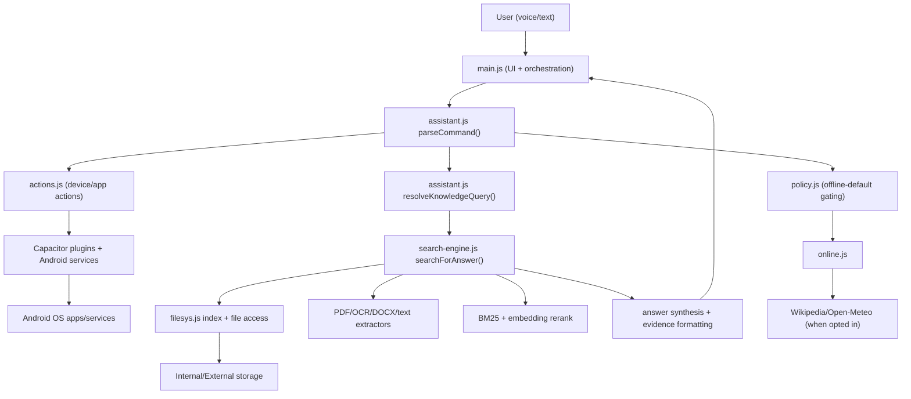
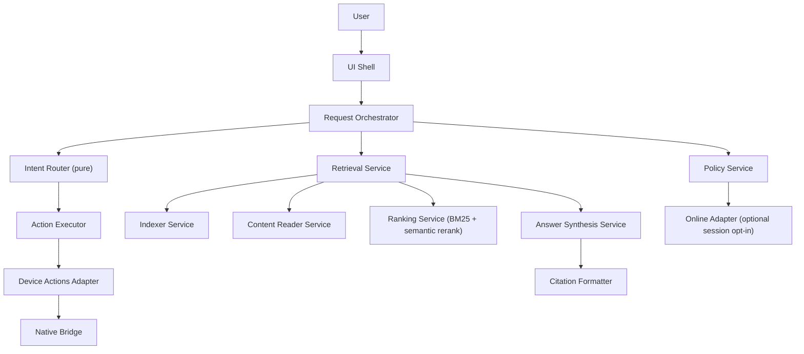

# Nice Assistant - Architecture Refactor v2

## Current Runtime Data Flow

## Root Architectural Issues

1. Over-centralized modules (`main.js`, `assistant.js`, `search-engine.js`) hold too many responsibilities.
2. Intent parsing layer depends on live file-search lookups.
3. Retrieval, ranking, synthesis, and markdown formatting are coupled.
4. Global mutable conversation state (`lastContext`, `pendingOpenChoice`) can misroute follow-up commands.
5. App launching relies on multiple fallback paths with inconsistent plugin binding.
6. Search rerank stage can become a sequential bottleneck under large candidate sets.

## Target v2 Architecture

## Migration Plan

### Phase 1 - Stabilize Critical Paths (Completed)
- Harden AppCatalog plugin path so app launch can work reliably on Android.
- Parallelize embedding rerank workers to reduce post-scan finalization latency.
- Keep full tests green after changes.

### Phase 2 - Decouple Intent Routing
- Extract `open` target disambiguation to a dedicated resolver module.
- Make `parseCommand` pure (no direct `searchFiles/findExactFileByName` calls).
- Move all file/app resolution to execution layer.

### Phase 3 - Split Retrieval Pipeline
- Split `search-engine.js` into:
  - `content-reader.js`
  - `ranker-bm25.js`
  - `ranker-semantic.js`
  - `answer-synthesizer.js`
  - `result-formatter.js`
- Keep `searchForAnswer(question, opts)` as facade for backward compatibility.

### Phase 4 - State and Reliability
- Replace global mutable context with scoped conversation session state.
- Add idempotent command execution tokens for concurrent requests.
- Add bounded retries and explicit error classes for read/extract/rerank stages.

### Phase 5 - Security and Privacy Consistency
- Encrypt chat and knowledge snapshots at rest with secure-store helpers.
- Keep only minimal telemetry/debug markers in plaintext localStorage.
- Add integrity version markers for persisted caches.

## Acceptance Criteria

1. Intent parsing remains deterministic and independent of storage access.
2. Search returns structured results from retrieval layer before UI formatting.
3. App/file/open routing ambiguity is handled by a single resolver service.
4. End-to-end tests pass (`npm run test:all`) with no regression in offline behavior.
5. Search completion latency improves for large candidate sets (rerank no longer fully sequential).

