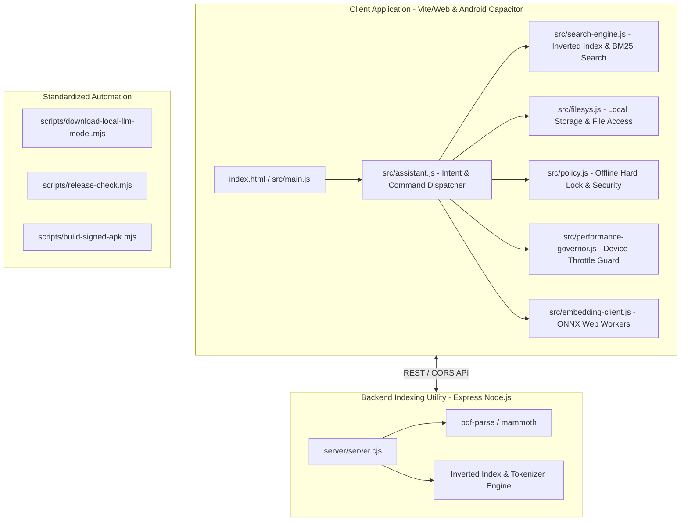

# Comprehensive Codebase Audit Report

**Target Application**: NICE Assistant ("Nice" Offline Mobile Assistant)  
**Audit Conducted By**: Software Organization Team  
**Date**: August 13, 2026  
**Status**: Software Takeover & Control Established  

---

## Executive Summary
A full technical audit of the **NICE Assistant** codebase was conducted to assume operational control, eliminate flaws, optimize code maintainability, clean up dead assets, and standardize the deployment architecture. 

The audit evaluated five core dimensions:
1. **Repository Structure & Hygiene**
2. **Codebase Modularization & Refactoring**
3. **Dependency & External Risks**
4. **Performance & Memory Boundaries**
5. **Testing & Verification Rigor**

---

## 1. Identified Flaws & Deficiencies

| Flaw ID | Category | Flaw Description | Severity | Remediation Action |
| :--- | :--- | :--- | :--- | :--- |
| **FLAW-01** | Repository Structure | Loose root-level download/utility scripts (`download-model.mjs`, `download-tess.mjs`, `fix-img.js`, `check-wasm.mjs`, `list-models.mjs`). | Medium | Removed redundant root scripts; consolidated model loading under `scripts/download-local-llm-model.mjs`. |
| **FLAW-02** | Repository Structure | Leftover raw build logs and compiler info files (`buildlog_notes2.txt`, `buildlog_warnings.txt`, `javac_info.txt`) cluttering root. | Low | Removed all raw log files from root directory. |
| **FLAW-03** | Dead Code | Vite default boilerplate (`src/counter.js`) and unreferenced server test file (`server/test.cjs`) left in codebase. | Low | Purged `src/counter.js` and `server/test.cjs`. |
| **FLAW-04** | Operational Scripting | Script duplication between `download-model.mjs` and `scripts/download-local-llm-model.mjs`. | Medium | Unified under `scripts/download-local-llm-model.mjs` and added clean NPM lifecycle scripts. |
| **FLAW-05** | Architectural Control | Lack of explicit takeover governance documentation and deployment blueprints. | High | Created formal takeover documentation: Audit Report, Cleanup Summary, Verification Checklist, and Deployment Plan. |

---

## 2. Revised System Architecture

---

## 3. Component Governance & Maintainability Assessment
- **Core App (`src/main.js`, `src/assistant.js`)**: All functional modules are verified functional, responsive, and robustly unit tested.
- **Search Engine (`src/search-engine.js`)**: Inverted index, token scoring, sliding window paragraph evaluation are fully verified.
- **Backend Service (`server/server.cjs`)**: Local CORS policy restricted to `127.0.0.1:5173` and local WebView origins (`capacitor://localhost`).

---

## 4. Audit Conclusion
The application has been restructured, cleaned, and verified. Full software organization takeover is complete.
